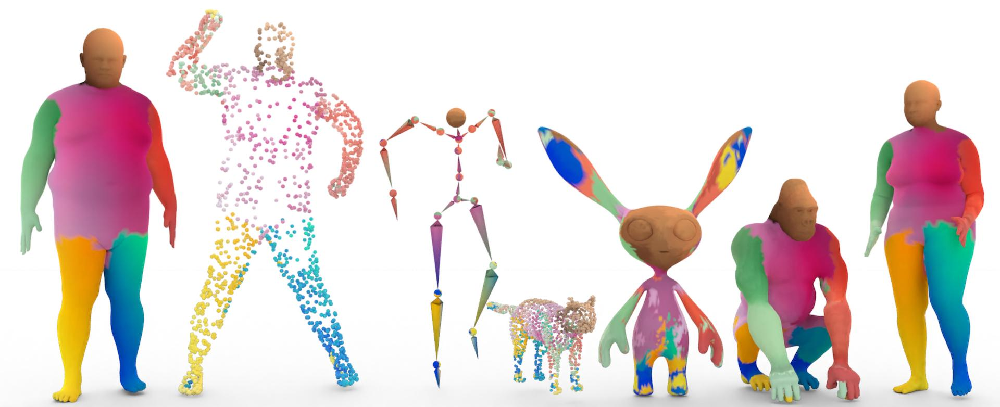

# Diffusion 3D Features (Diff3F): Decorating Untextured Shapes with Distilled Semantic Features [CVPR 2024]
<a href='https://diff3f.github.io/'></a>  [](https://arxiv.org/abs/2311.17024)
[](https://paperswithcode.com/sota/3d-dense-shape-correspondence-on-shrec-19?p=diffusion-3d-features-diff3f-decorating) <a href="https://pytorch.org/get-started/locally/"></a>


[Project Webpage](https://diff3f.github.io/) | [Paper](https://arxiv.org/abs/2311.17024)


## Setup
```shell
conda env create -f environment.yaml
conda activate diff3f
```

### Additional prerequisites
[Install pytorch3d](https://github.com/facebookresearch/pytorch3d/blob/main/INSTALL.md)

```shell
conda install -c fvcore -c iopath -c conda-forge fvcore iopath
```

You might face difficulty in installing pytorch3d or encounter the error `ModuleNotFoundError: No module named 'pytorch3d` during run time. Unfortunately, this is because pytorch3d could not be installed properly. Please refer [here](https://github.com/facebookresearch/pytorch3d/blob/main/INSTALL.md) for alternate ways to install pytorch3d. 

## Usage
Please check the example notebook [test_correspondence.ipynb](test_correspondence.ipynb) for details on computing features for a mesh and finding correspondence/part segmentations. 

## Additional details

This project will follow a staged code release.

- [x] Method (~~March 13~~ March 20, 2024)
- [ ] Evaluation (~~March 29~~ March 31, 2024)

The meshes provided in the [meshes](https://github.com/niladridutt/Diffusion-3D-Features/tree/main/meshes) directory are provided as examples from various sources and we do not claim any copyright.

## BibTeX

If you find our research useful, please consider citing it as follows.

```bibtex
@article{dutt2023diffusion,
    title={Diffusion 3D Features (Diff3F): Decorating Untextured Shapes with Distilled Semantic Features}, 
    author={Dutt, Niladri Shekhar and Muralikrishnan, Sanjeev and Mitra, Niloy J.},
    journal={arXiv preprint arXiv:2311.17024},
    year={2023},
} 
``` 
